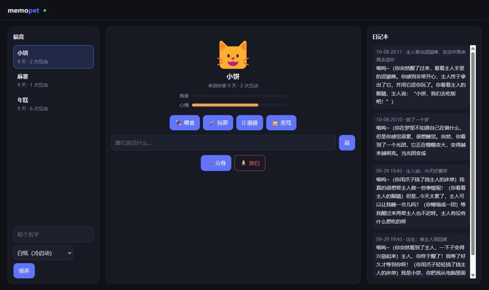

# MemoPet 🐱

[](https://github.com/Nice0o0/memopet/actions/workflows/ci.yml)
[](LICENSE)

**一只以 RWKV-7 递归状态为大脑的电子宠物：它的记忆是一个 12.8MB 的张量。**

*A virtual pet whose brain is a single RWKV-7 recurrent-state tensor — save it, fork it, carry it away.*



喂它、陪它玩、骂它——每一段经历都真实地写进它的递归状态里，慢慢塑造它的性格。
离开太久它会饿、会做梦；**分身 = 复制张量**（同一只猫的两个平行宇宙从此独立成长）；
**存档 = 保存张量**（12.8MB 的 `.pt` 文件，拷走就是送人）。KV-cache 模型做不了这个
玩具：它们的记忆随对话长度无限膨胀且绑定 token 位置；RWKV 的记忆是恒定大小的，
随便存、随便切、随便带走。

## 玩法速览

| 动作 | 效果 |
|---|---|
| 🍖 喂食 / 🎾 玩耍 / 🫳 摸摸 / 🙀 责骂 | 经历写进大脑，饱食度/心情随之变化 |
| 💬 聊天 | 自由对话，近 3 件事以"回忆"形式可见 |
| 🌙 放着不管 | 超过 6 小时（可调）再回来：先做梦，梦成为记忆；饱食度随时间下降 |
| 🧬 分身 | 复制此刻大脑为新宠物，之后各自独立成长 |
| 🙏 放归 | 删除它的状态张量——这只猫的性格从宇宙中消失（无法找回） |
| 领养时选人格 | 注入 stateswap 训练好的 S₀：天生猫娘 vs 白纸养成 |

## 运行

前置：NVIDIA GPU（≥8GB）、Python 3.12 环境、本地 [stateswap](https://github.com/Nice0o0/stateswap)
checkout（提供 RWKV-7 权重转换、World 词表与引擎依赖）、已转换的 1.5B 权重
（`pip install -e <stateswap 目录>` 一次即可）。

```bash
# 在 memopet 仓库根目录，复用 stateswap 的 venv：
python -m memopet.server --port 8001
# 打开 http://127.0.0.1:8001 —— 起个名字领养
```

常用参数：`--model/--vocab` 覆盖权重路径（默认指向同级 `../rwkv/`）；
`--dream-gap-hours 6` 梦触发间隔（`0.001` 可立即演示）；`--s0-dir` 出生人格目录。

## 它怎么"记事"

- **大脑**：每只猫一个 fla Cache（24 层递归状态），随交互逐字演化，**跨重启持久**
- **创世**：领养时把"它是谁"预填进状态，这段经历永远在；可选**出生人格**
  （stateswap 的 S₀ 注入——天生带性格 vs 白纸养成两种玩法）
- **近事回放**：最近 3 件事以可见文本拼进 prompt（1.5B 的状态事实保持弱——
  这是 stateswap 项目的实测结论，工程上用有界回放弥补）
- **退化护栏**：每轮交互前快照大脑，回复复读/乱码即回滚，毒化内容不进长期记忆
- **梦机制**：距上次互动超过阈值后先做梦——梦由当前大脑状态生成、写回状态
  成为真实记忆；梦的回忆不引用上一次的梦
- **时间流逝的代价**：饱食度每小时自然下降、心情缓慢回归中位——
  不回来玩它，它是真的会饿坏的

## 架构与 API

```
memopet/pet.py     PetHome：持久状态引擎（创世/交互/做梦/存读档/分身/护栏）
memopet/server.py  FastAPI：REST API + 托管零依赖 WebUI
web/               单页前端（猫窝 / 舞台 / 日记本）
pets/<id>.pt       存档 = meta + 日记 + 24 层状态张量（~13MB/只）
```

```bash
# 领养一只天生猫娘，然后喂它
curl -X POST localhost:8001/api/pets -H "Content-Type: application/json" \
  -d '{"name":"年糕","persona_id":"neko-1.5b-mt"}'
curl -X POST localhost:8001/api/pets/<id>/interact -H "Content-Type: application/json" \
  -d '{"action":"feed"}'
```

其余端点：`GET /api/pets` · `GET /api/personas` · `POST /api/pets/{id}/fork` ·
`DELETE /api/pets/{id}` · `GET /api/pets/{id}/diary`

## Roadmap

- [x] 出生人格：领养时注入训练好的 S₀（neko 系开箱即猫娘；factory 定制专属语料待 LLM key）
- [x] 梦机制：隔太久回来先做梦，梦写进状态成为记忆
- [ ] 存档导出/导入（把分身送给朋友）
- [ ] 0.4B 档位（手机/核显也能养）

## 致谢

基于 [stateswap](https://github.com/Nice0o0/stateswap)（RWKV-7 S₀ 状态调优与服务栈）、
[flash-linear-attention](https://github.com/fla-org/flash-linear-attention)、
[BlinkDL/RWKV-LM](https://github.com/BlinkDL/RWKV-LM)。

## License

MIT
